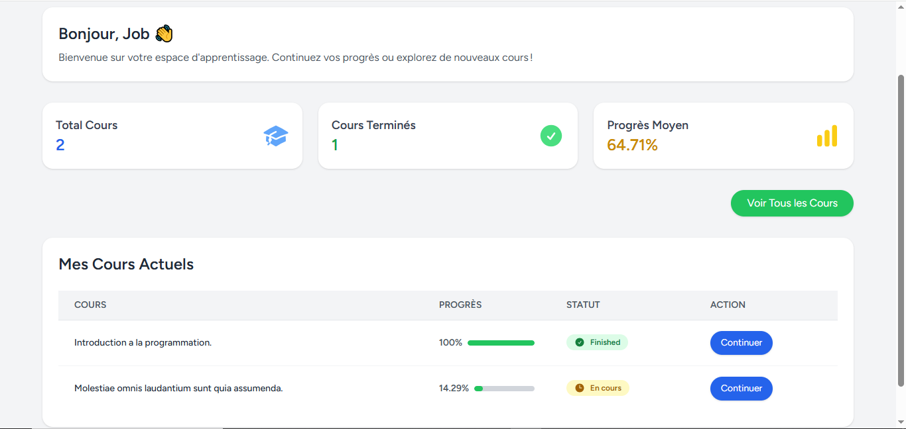
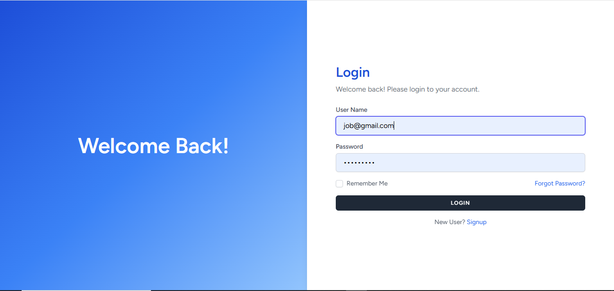
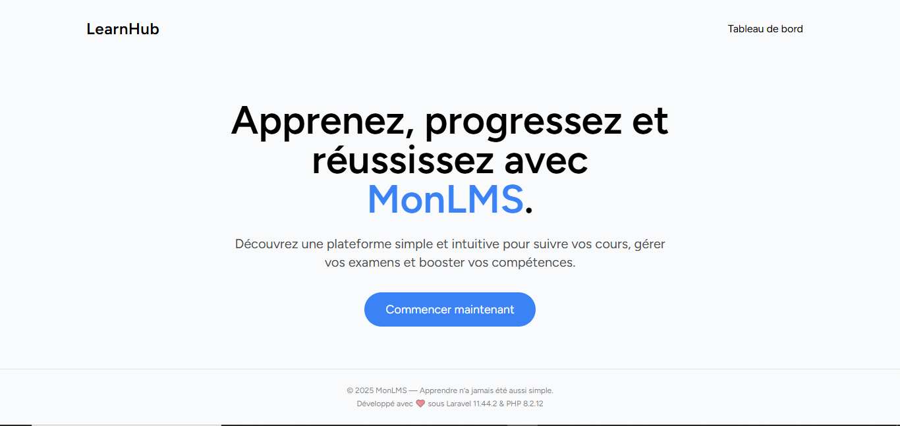
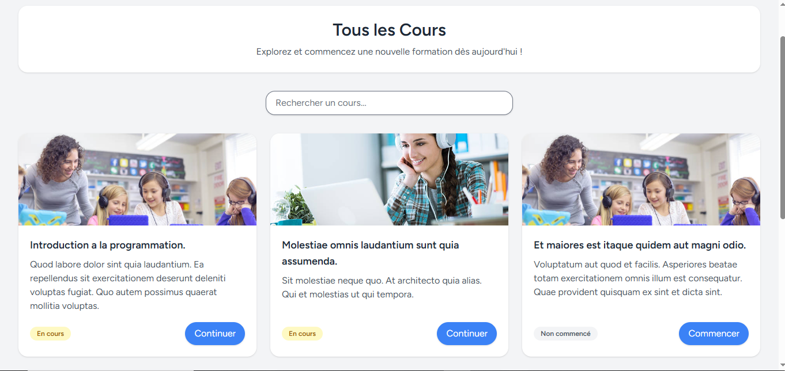
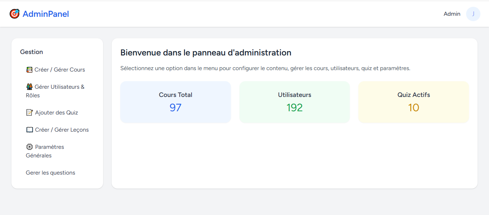
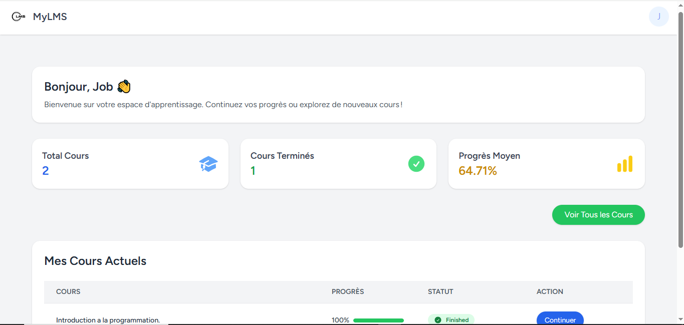

---

## 🇬🇧 README in English

```markdown
# Mon LMS - Online Learning Management System

Welcome to **Mon LMS**, a web application for managing online courses and lessons.

## 🚀 Technologies used

- Laravel 11
- Inertia.js
- Vue.js 3
- Jetstream
- Tailwind CSS
- SweetAlert2
- Toastify.js
- MySQL
- PHP 8.3

## 📚 Main Features

- Course management
- Lesson management
- User registration and tracking
- Lesson progress tracking
- Quiz taking and results
- Dashboard for administrators and students
- Site settings (site name, logo, items per page)

> 🔥 The project is already **functional**, but it is **not fully perfect yet**.  
> A more complete and improved version is planned in the future.

## ⚙️ Local Installation

1. Clone the repository:
   ```bash
   git clone https://github.com/YOUR-USERNAME/YOUR-REPO.git
 git clone https://github.com/stevarison6/lms-laravel.git

2.Navigate to the project folder:
cd lms-laravel

3.Install PHP dependencies:
composer install

4.Install Node.js dependencies:
npm install && npm run build

5.Copy the .env file:
cp .env.example .env

6.Generate the application key:
php artisan key:generate

7.Configure your database settings inside .env.

8.Run the migrations and seeders:
php artisan migrate --seed

9.Start the development server:
php artisan serve
10.Overview
https://github.com/stevarison6/lms-laravel/blob/main/screenshot/overwiew-1.PNG







🎯 Important Notes
Access to special admin pages is protected by an "admin" middleware.

Regular users can only see their enrolled courses.

🧑‍💻 Author
Arison NOMENJANAHARY
stevarison6
